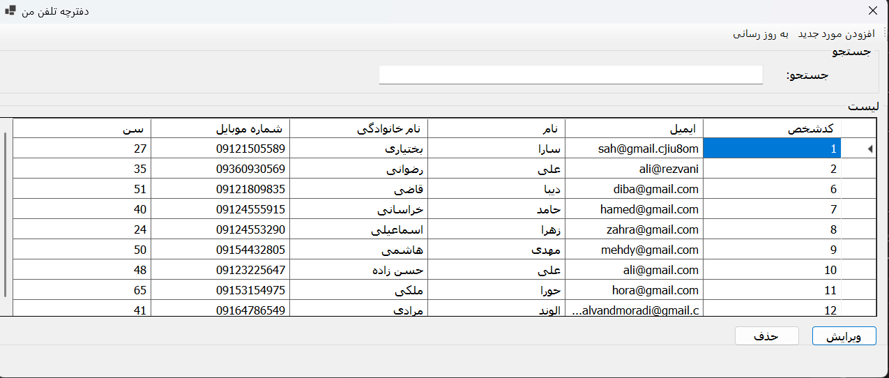
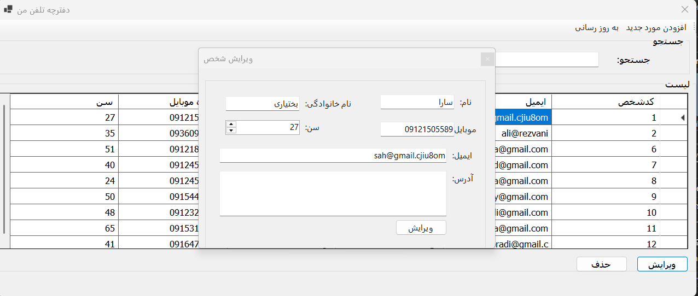
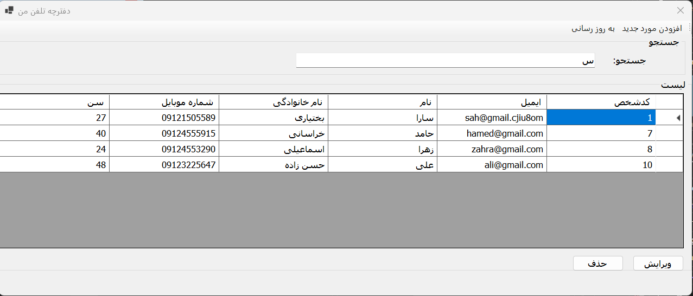

# 📒 Contact Book

A simple and user-friendly Contact Book application built with **C# (.NET Framework)** and **Windows Forms**, connected to a **SQL Server** database using **ADO.NET**.

---

## ✨ Features

- ➕ Add new contacts  
- 📝 Edit existing contacts  
- ❌ Delete contacts  
- 🔍 Search through contacts  
- 🎨 Clean and intuitive interface

---

## 🖼️ Screenshots

### 📄 Main Page  
This is the main dashboard where you can view all contacts.  

---

### 🛠️ Edit Contact  
Update existing contact details using the Edit form.  

---

### 🔎 Search Contact  
Search contacts easily using the built-in search functionality.  

---

## 🛠️ Technologies Used

- **C# (.NET Framework)**
- **Windows Forms (WinForms)**
- **SQL Server**
- **ADO.NET**

